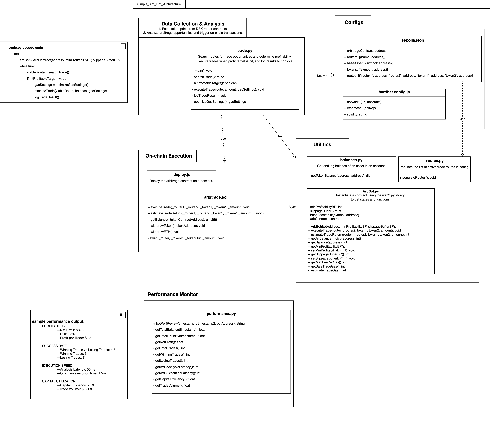

# Simple Arbitrage Bot Architecture Design 

## UML

## Modules
### Configs
**sepolia.json**: config file for the sepolia network. 
- ***arbitrageContract***: the on-chain address of the arbitrage contract deployed.
- ***routers***: the router contract addresses of the DEXes being monitored.
- ***baseAsset***: the assets owned and tradable in user wallet.
- ***tokens***: all tokens listed and provided by all routers.
- ***routes***: active viable trade routes that allows trading of token1 to token2 on router1, and then token2 back to token1 on router2. The routes are generated by *routes.py* in *Utilities*. 
  
**hardhat.config.js**: configs/mainnet.json for deployment of *arbitrage.sol*.

### Data Collection and Analysis
**trade.py**: Searches routes for trade opportunities and determine profitability. Execute trades when profit target is hit, and log results to console.

### On-chain Execution
**deploy.js**: Deploys the arbitrage.sol contract on a network as specified in *hardhat.config.js*.

**arbitrage.sol**: Arbitrage contract that estimates a trade return for off-chain view and executes a trade on-chain. It also allows the contract owner to withdraw assets from the contract through a function call to *withdrawToken*().

### Utilities
**balances.py**: 
- ***getTokenBalance(accountAddress, assetAddress)***: Gets and logs the balance of an asset in an account. Called in *trade.py* as an argument to executeTrade as a trade can only succeed when there's enough balance of the baseAsset in the user wallet.
  
**routes.py**:
- ***populateRoutes()***: Populates *routes* in *sepolia.json* by permutating the combination of *routers* and *tokens*, and checking if there's a viable trade route on-chain.
  
**ArbBot.py**: Models the on-chain smart contract so that all on-chain functions can be easily called off-chain, while providing some additional functions to get network gas consumption details. Maintains arbitrage trading states like profitability and slippage settings.

### Performance Monitor
The performance of the strategy is determined with the following four metrics.
1. **Profitability**
    - **Net Profit:** Calculate the total profits after deducting all costs, including transaction fees, gas fees, and any other operational costs. Net Profit = BalanceAfter - BalanceBefore.
    - **Return on Investment (ROI):** ROI = (Net Profit / Total Investment) * 100%. This measures the efficiency of the investment. Specifically, total investment refers to all liquidity provided to the arb contract as well as gas.
    - **Profit per Trade:** Average profit per arbitrage opportunity.
2. **Success Rate**
    - **Winning Trades vs. Losing Trades:** The ratio of profitable trades to unprofitable trades. Losing trades include both trades that execute on exchanges with a net loss, and trades that fail to execute on exchanges but incur gas costs.
3. **Execution Speed**
    - **Analysis Latency:** Time taken to detect and execute an arbitrage opportunity.  
    - **On-chain Execution Time:** The time between placing the order and the order getting executed, which reflects gas price competitiveness and serves gas optimization reference.
4. **Capital Utilization**
    - **Capital Efficiency:** Percentage of available capital actively used in arbitrage opportunities, calculated with averageLiquidity/totalLiquidity. This does not factor in gas.
    - **Trade Volume:** The total volume of trades executed by the bot.

### Additional Notes
I found an existing open-source arb bot template: https://github.com/jamesbachini/DEX-Arbitrage. It has several limitations including:
1. being JavaScript-based and is an outdated implementation
2. doesn't factor in gas cost at all in calculating profit and optimizing contract code
3. has 0 documentation
4. has very incoherent code style and large volumes of unnecessary code reuse