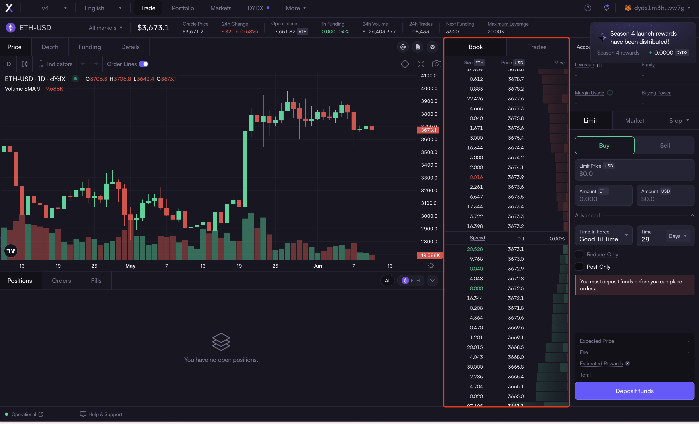
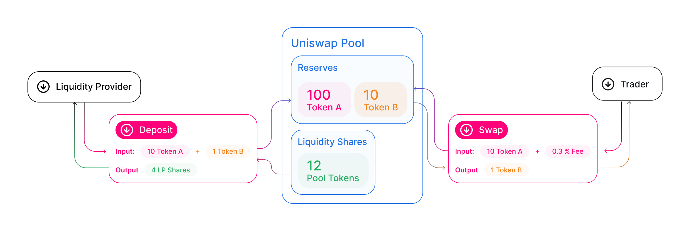
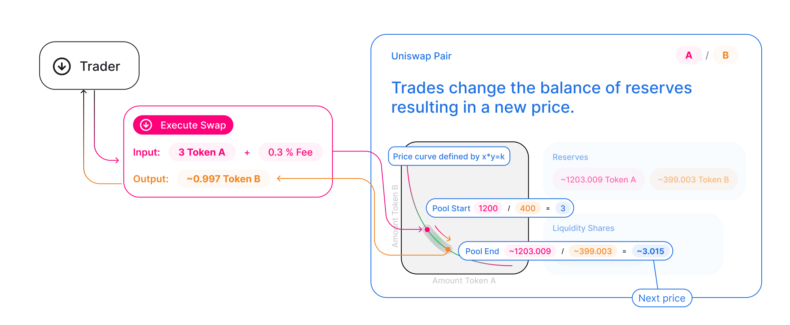

# Simple Arbitrage Bot Product Design
## Background and Motivation

Arbitrage is a trading strategy that involves taking advantage of price discrepancies of the same asset in different markets or forms to make a profit without risk. The core idea is to buy low in one market and sell high in another simultaneously, thereby capitalizing on the price difference. 

With the rise of blockchain technology, decentralized exchanges (DEXes) have seen tremendous growth. The top 10 DEXs, including Uniswap, Curve, and PancakeSwap, had a combined trading volume of $66.6 billion in Q2 2023. The price discrepancies of assets across these different DEX markets thus become huge arbitrage opportunities that I'm interested in exploring.

This project aims to develop an automated arbitrage bot that profits from the price differences of the same asset in different DEX markets. This bot will be designed to collect live price feeds through API integrations with various on-chain decentralized exchanges. By continuously analyzing these price feeds, the bot will make informed decisions about when to trigger on-chain smart contract calls to execute simultaneous arbitrage transactions. The ultimate goal is to profit from these transactions while contributing to the overall efficiency and balance of DeFi markets by aligning prices across different markets or exchanges. 

## Project Arbitrage Strategy
#### How Arbitrage Works in Decentralized Exchanges

1. **Identification of Price Discrepancy**: The trader identifies an asset that is priced differently in two or more markets.
2. **Simultaneous Transactions**: The trader buys the asset at the lower price in one market and sells it at the higher price in another market simultaneously.
3. **Profit Realization**: The profit is the difference between the buying and selling prices, minus any transaction costs such as blockchain gas fees and exchange costs.

#### Major Types of On-Chain DEXes
On-chain exchanges are decentralized platforms that facilitate the trading of cryptocurrencies directly on the blockchain. The two major types of on-chain exchanges are Central Limit Order Book (CLOB) exchanges and Automated Market Maker (AMM) exchanges.

1. Central Limit Order Book (CLOB) Exchanges operate similarly to traditional financial exchanges. They maintain an order book that lists all the buy and sell orders for a particular asset, and trades are executed when buy and sell orders match.
   
   Key features of a CLOB exchange include:
	- **Order Book**: A ledger where all buy and sell orders are recorded.
	  
							
ETH-USD Perpetual's Orderbook on dYdX Exchange

	
	- **Order Matching**: Orders are matched based on price and time priority.
	  
	- **Trade Execution**: Trades occur when buy and sell orders match.
	  
	- **Liquidity Providers**: Users place orders in the order book, providing liquidity.
   

2. Automated Market Maker (AMM) Exchanges use smart contracts to create liquidity pools, where users can trade against the pool rather than matching with another user. Prices are determined by mathematical formulas.

   Key features of an AMM exchange include:
	- **Liquidity Pools**: Pools of tokens provided by liquidity providers (LPs). Each liquidity pool is a trading venue for a pair of tokens.
	  
					
Concept of an AMM pool by Uniswap

	
	- **Pricing Algorithm**: Prices are determined by algorithms like the constant product formula (x * y = k).
		
			
Concept of an AMM Swap by Uniswap

	
	- **Liquidity Providers**: Users provide liquidity to pools and earn fees.

Since prices are discovered in a different way on each model, this creates many arbitrage opportunities between **CLOB x AMM** or even between two different AMMs.

#### Factors in a Profitable Arbitrage Transaction
1. Slippage
   Slippage refers to the difference between the expected price of a trade and the actual price at which the trade is executed. In the context of an arbitrage trade, slippage refers to the price change between the time an arbitrage opportunity is spotted and the time the arbitrage trade is finalized on-chain. Slippage can occur due to various factors, including low liquidity, high volatility, or delays in transaction processing.
   
   - Liquidity: AMMs rely on liquidity pools to facilitate trades. If a liquidity pool has a small amount of an asset, large trades can significantly impact the price, leading to higher slippage. In contrast, larger liquidity pools can absorb bigger trades with minimal price impact, reducing slippage.
     
   - Volatility: High volatility in the market can lead to rapid price changes, increasing the likelihood of slippage, increasing the likelihood of slippage.
     
   - Blockchain transaction speed: Due to the nature of blockchain, every transaction on-chain participates in an auction, where all users compete to see who will pay more to have their transactions validated first on the blockchain. Users can set a **gas price** for their transaction, where a higher gas price means higher resulting gas cost, but faster processing time of their transaction; a lower gas price means saving on transaction costs, but risking too long to complete the transaction and losing the arbitrage opportunity. Thus, an arbitrageur must always be looking for the best blockchain transaction price, balancing cost and speed.
     
     Simple elegant **efficient** code

2. Concurrency
   Trades must be executed as fast as possible to capture the price difference opportunity of an asset. This means that funds will need to be deposited on both wallets for the different markets so that the bot can do both the buy and sell transactions at the same time.

3. Costs
   Profitability of an arbitrage trade also needs to factor in the blockchain gas cost, and the exchange transaction fees.

#### Strategy Design
With the profitability factors listed above, my strategy will be formulated around the following design principles:
1. An arbitrage trade will only be executed when the $\text{price difference(\%)}$ based on a user-defined $\text{minimum profitability(\%)}$ is reached.
   
2.  $\text{price difference(\%)}$ is calculated using the following formula:
   $$\text{min. profitability}+\frac{(\text{gas costs + trading fees + revert overhead})}{\text{order value}}+\text{slippage buffer}$$

3. The $\text{revert overhead}$ is calculated using the following formula:
   $$\text{avg. gas cost per reverted transaction} * \text{revert rate up to the last transaction}$$

4. The $\text{slippage buffer}$ is a user-defined percentage enforced on AMM trades, which will fail a trade if the final slippage exceeds the pre-defined percentage.

5. Trades in one arbitrage transaction will be executed only when both trades can be executed under predefined $\text{minimum profitability}$ and $\text{slippage buffer}$, through smart contract enforcement. If any condition causes at least one trade to fail, the transaction is reverted, ensuring that neither trade is executed.

References: 
How to arbitrage AMMs like Uniswap and Balancer.
https://hummingbot.org/academy-content/how-to-arbitrage-amms-like-uniswap-and-balancer/

HummingBot's implementation of an arbitrage strategy between a SPOT CLOB CEX and a SPOT AMM DEX: https://hummingbot.org/strategies/amm-arbitrage/; trading logic: https://github.com/hummingbot/hummingbot/blob/master/hummingbot/strategy/amm_arb/amm_arb.py

## Existing frameworks and tools to leverage
#### Bot frameworks
1. to add some summaries on features offered and differences
2. backtest existing strategies/bots to see profitability and transaction success rate;
HummingBot: open-source framework that helps you design, backtest, and deploy automated trading bots. https://hummingbot.org/

FreqTrade: open-source trading bot written in python. It supports backtesting, plotting, money management, and strategy optimization by machine learning. https://www.freqtrade.io/en/stable/

#### API testing
Postman - API platform for building and using APIs. https://www.postman.com/

#### Smart Contract development
Hardhat -  a development environment for Ethereum software. Compile, test, debug and deploy smart contracts. Supporting network forking to simulate real data in a test environment. Tutorial: https://hardhat.org/tutorial

#### Profitability calculation
Etherscan Gas Tracker - provides real-time gas prices, offering estimates for low, average, and high gas prices. https://etherscan.io/gastracker

Web3 - calculate how much gas a smart contract interaction would use. https://www.npmjs.com/package/web3